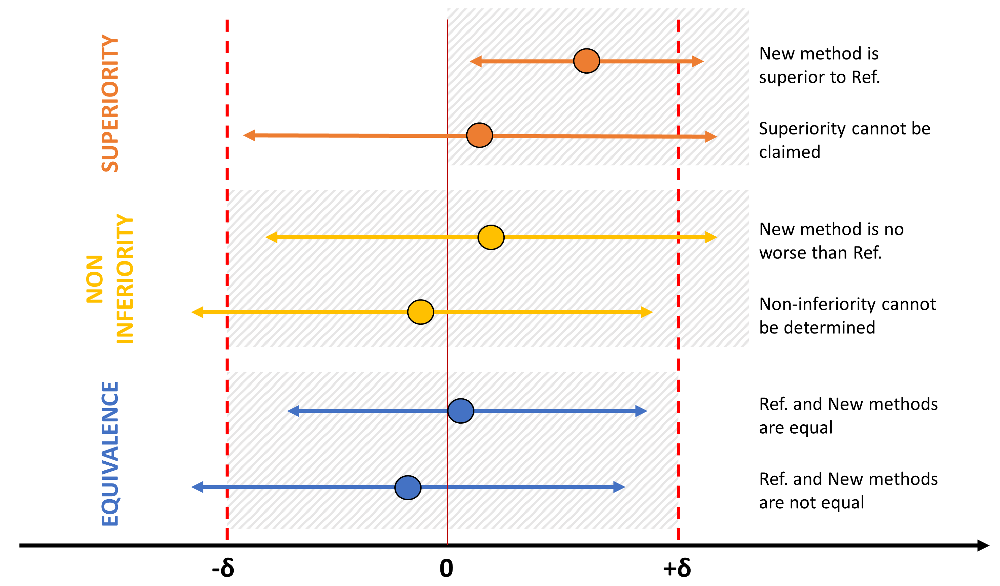

# equiv_med
[](https://doi.org/10.5281/zenodo.6504217)<br />
Python functions for clinical **equivalence testing**. An overview is provided in the following figure:<br />


The repository contains Python functions to produce novel graphs for biomedical biosimilarity testing. Visualization enhances the interpretation and storytelling of statistical tests. Each function automatically checks the preliminary assumptions of the tests and is paired with console outputs. The scripts were subdivided into four macro-areas following the scheme in the figure. Users interested in running bio-similarity analysis can download the code and follow the instructions in the referenced manuscript or try the minimal working examples.

# Installation
```Python
pip install git+https://github.com/m89p067/equiv_med.git
```
Please check pip, git and setuptools are properly installed on your system.

# Explanations, references, and examples included in:<br />
M. Nascimben and L. Rimondini <br />
*Visually enhanced python function for equality of measurement assessment*<br />
Presented during the IEEE FedCSIS 2022 conference (4-7 September, Sofia, Bulgaria)<br />
The peer-reviewed conference paper is in "Annals of Computer Science and Information Systems" (ACSIS)
<https://annals-csis.org/Volume_32/>

# **Minimal working examples**
## Equivalence and agreement between measurements
Create two random vectors simulating the outputs of a new and an old device (could be also data from two assays, two drugs, two equipments or organic samples). One might be a reference method or a gold-standard, and the other a new device or data collected employing a new procedure.
```Python
import numpy as np
mu1,sigma1=100.2,62.6
mu2,sigma2=130.9,80.2
var1= np.random.normal(mu1, sigma1, 300)
var2= np.random.normal(mu2, sigma2, 300)
```
### Bland-Altman revised plot
Evalutes the laboratory outputs of two devices or values of two organic samples and checks the agreement
```Python
from equiv_med.EQU import eq_BA
my_BA=eq_BA.BA_analysis(var1,var2)
#Bland-Altman plot
my_BA.run_analysis() # default 95% of the difference will lie in this interval [revised plot]
# Evaluate sample size and assurance probability of exact agreement limist (as in [10])
#Exact limits of agreement sample size (as in [10])
out1=my_BA.exact_Bound_sample_size(mu1,sigma1,len(var1),95,0.05)
out2=my_BA.exact_Bound_sample_size(mu2,sigma2,len(var2),95,0.05)
#Exact limits of agreement assurance (as in [10])
out3=my_BA.exact_Bound_assurance(mu1,sigma1,len(var1),95,0.05,0.9)
out4=my_BA.exact_Bound_assurance(mu2,sigma2,len(var2),95,0.05,0.9)
#In case of repeated measures
my_BA.minimal_detectable_change() #output also Minimal Detectable Change 
```

### Regression residuals diagnostics 
Creates a linear model old vs. new methodology and evaluates the residuals for influential points evaluation
```Python
from equiv_med.EQU import eq_Regr
my_regr=eq_Regr.Regr_diagn(var1,var2)
my_regr.run_diagnostic([0.05,0.1,0.2]) # Cook distances values 
my_regr.influential_points() #DIFFITS & DFBETAS with default thresholds
```

### CatEyes plots 
Visualization and comparison graph of 95% confidence intervals for the two measurements
```Python
from equiv_med.CI import ci_Cateyes
my_ce=ci_Cateyes.Cat_Eye_2var(var1,var2)
my_ce.run_ce(95) # C.I. value
my_ce.run_ce_unbiased(95) # C.I. value
my_ce.single_cat_eye(var1,95) # C.I. value
```

### Cohen's d
Effect size (automatic calculation of the right formula based on input data) and visualization
```Python
from equiv_med.ES import Cohen_family
d_meas=Cohen_family.Cohen_es(var1,var2,design='indep')
print('Cohen d :', d_meas.Cohen_d())
print('Lambda parameter (non centrality) :', d_meas.lambda_par())
print('Variance of Cohen d :',d_meas.standard_error_cohen() )
print('CI :',d_meas.CI_cohen())
d_meas.plotting() # Cohen d descriptive graph
```

### Standard TOST
Please refer to the following image for a quick understanding of equivalence, non-inferiority and superiority tests using differential confidence intervals and user-defined regulatory boundaries $\pm \delta$


Equivalence testing 
$$H_{0} : \overline{m_{1}}-\overline{m_{2}}\leq-\delta\quad or\quad \overline{m_{1}}-\overline{m_{2}}\geq\delta $$
$$H_{1} : -\delta<\overline{m_{1}}-\overline{m_{2}}<\delta$$
```Python
from equiv_med.EIS import Standard_Tost
eq_tost=Standard_Tost.EQU(var1,var2,-5.5,5.5) # [-5.5;5.5] are the user-defined regulatory boundaries simmetric to zero
eq_tost.run_Tost_indep() # Independent samples
eq_tost=Standard_Tost.EQU(var1,var2,-5.5,5.5) # [-5.5;5.5] are the user-defined regulatory boundaries simmetric to zero
eq_tost.run_Tost_dep() # Dependent samples
```

### Special implementation of TOST tests
TOST implemented as in [20]
```Python
from equiv_med.EIS import Tost_WS
out1=Tost_WS.WS_eq(var1,var2,5)
out1.run_TOST()
out1.power_TOST()
out1.opt_sample_size()
```
TOST implemented as in [17,18]
```Python
from equiv_med.EIS import Tost_Alt
test_a=Tost_Alt.TOST_T(var1,var2)
test_a.run_TOST_T()
test_a.run_TOST_MW()
```
TOST implemented as in [19] for paired measurements
```Python
from equiv_med.EIS import Tost_NCP
tost_res=Tost_NCP.Tost_paired(var1,var2,5.5)
tost_res.run_tost()
tost_res.stat_power()
tost_res.opt_sample_size()
```

### Non-Inferiority and Superiority tests
Non-inferiority hypothesis testing (might be in the reversed form)
$$H_{0} : \overline{m_{1}}-\overline{m_{2}}\leq-\delta$$
$$H_{1} : \overline{m_{1}}-\overline{m_{2}}>-\delta$$
Superiority hypothesis testing (usually setting $\delta = 0$)
$$H_{0} : \overline{m_{1}}-\overline{m_{2}}\geq\delta$$
$$H_{1} : \overline{m_{1}}-\overline{m_{2}}<\delta$$

Implementation of both methods follow [21]
```Python
from equiv_med.EIS import Inf_or_Sup
# Testing Non - Inferiority
infer=Inf_or_Sup.IoS(var1,var2)
infer.non_inferiority(ni_bound=0.1)
infer.non_inferiority(ni_bound=0.65)

# Superiority
sup=Inf_or_Sup.IoS(var1,var2)
sup.superiority(sup_bound=0)
sup.superiority(sup_bound=0.3575)
```

### Region of practical equivalence
Region of practical equivalence (i.e. ROPE) as in [22]
```Python
from equiv_med.EIS import ROPE_test
out2=ROPE_test.ROPE(var1, rope_range=[-0.3,0.3]) #user-defined ROPE region [-0.3,0.3]
out2.rope_calc()
```
## Laboratory test evaluation
Simulate disease status and laboratory test outcomes for ten patients assuming 0s mean negative results and 1s mean postive results
```Python
import numpy as np
disease_labels=np.asarray([1,1,1,1,0,0,0,0,0,0])
diagnostic_results=np.asarray([1,1,0,1,1,0,0,1,0,0])
```
### 2x2 frequency table and performance indexes
Contingency Table creation, performance indexes calculation and their comparisons with graphs
```Python
from equiv_med.ROC import Frequency_table as fr_tb
ft=fr_tb.Freq_table(diagnostic_results,disease_labels) # Cross-table
out=ft.performance_indexes() # Performance indexes calculation
print(out) # printing performance indexes
```
Performance indexes are:
* Subjects with the disease TP+FN  
* Subjects without the disease TN+FP  
* True positive fraction aka Sensitivity  
* False Negative Fraction aka 1-Sensitivity  
* True Negative Fraction aka Specificity  
* False Positive Fraction aka 1-Specificity  
* Positive Predictive Value  
* Negative Predictive Value  
* Positive Likelihood Ratio  
* Negative Likelihood Ratio  
* Diagnostic Odds Ratio  
* Diagnostic effectiveness (accuracy)  
* Youden index  
* Cohen kappa coefficient  
* Balanced accuracy  
* Error rate  
* False negative rate  
* True negative rate  
* False positive rate  
* False discovery rate  
* False omission rate  
* Precision  
* Recall  
* F-measure (aka F1-score or simply F-score)  
* G measure  
* Matthews correlation coefficient  
* Bookmaker informedness  
* Markedness  
* Number necessary to test 
* Number necessary to diagnose  
* Critical success index  
* Prevalence  
* Prevalence threshold  
* Fowlkes–Mallows index  
* Bias  

These indexes from two devices or laboratory tests could be compared using Radar plots. User should provide a list of indexes (names will be automatically abbreviated on the figures)
```Python
from equiv_med.ROC import Radars
# users define the indexes that should be included in the radar plots (minimal 5 indexes, max 9 indexes)
indexes_list=['Error rate','Recall','G measure','Prevalence', 'False discovery rate','Recall'] #list with indexes names 
rdr2=Radars.Radar_plots(indexes_list)
rdr2.radar_plots(out,out2,overlapping=True) # Radar plot
rdr4=Radars.Radar_plots(indexes_list,print_abbr=True)
rdr4.polar_bars(out,out2) # Second type of graph using bars
```

### ROC curves
In this example the ROC curve is created using the columns "texture_mean" and "diagnosis_category" of the Breast Cancer Wisconsin (Diagnostic) Data Set.
```Python
from equiv_med.ROC import Roc_youden
out_roc=Roc_youden.Youden_Roc(texture_mean, diagnosis_category)
out_roc.plot_roc_youden()
```
Statistical test for independent and dependent ROCs evaluation using DeLong method (test hypothesis that the ROC curves are equal [25])
```Python
# not providing real data in this example
from equiv_med.ROC import DeLong_independent
from equiv_med.ROC import DeLong_dependent
dl_data=DeLong_independent.DeLong_indep(true_labels1,probab1,true_labels2,probab2) 
dl_data.dl_indep()
dl_data2=DeLong_dependent.DeLong_dep(true_labels1,probab1,probab2)
dl_data2.dl_dep()
```
Statistical test for independent and dependent ROCs evaluation using Venkatraman method [26,27] over all operating points
```Python
# not providing real data in this example
venk=Venkatraman_independent.Venkatraman_indep(true_labels1,probab1,true_labels2,probab2)
venk.v_indep(2000) # number of bootstrap replicates
venk=Venkatraman_dependent.Venkatraman_dep(true_labels,probab1,probab2)
venk.v_dep(2000) # number of bootstrap replicates
venk.do_plot(5000) # number of bootstrap replicates
```

### Ranking plots
In this example the Ranking curves are created using the columns "texture_mean" and "diagnosis_category" of the Breast Cancer Wisconsin (Diagnostic) Data Set.
- precision vs. recall plot (with AUC)
- true positive vs. false positive rates graph (with Kolmogorov-Smirnov statistic in the standard and truncated forms)
```Python
from equiv_med.ROC import Ranking
out1=Ranking.Ranking_plots(texture_mean, diagnosis_category)
out1.ranking_plot() # includes Kolmogorov-Smirnov stats
out1.calculate_AP()
```

## Special case functions
### Stacked representations of confidence intervals 
The graph simulates a certain number of confidence intervals: it helps determine the percentage of values falling below a regulatory boundary
```Python
import numpy as np
from equiv_med.CI import ci_find_margin
variab=np.random.normal(loc = 10, scale = 2.3, size = (100,))
margin=np.mean(variab)
margin_help=ci_find_margin.Id_margin(variab)
# Simulating Coefficient of Variation (known variability between measurements)
margin_help.decision_perc(9.75,noise_variability=0.05) # regulatory boundary inserted by user is 9.75
```

### Inherent imprecision
Laboratory errors can be subdivided in systematic and random errors. Random errors can be evaluated in terms of imprecision (script includes automatic Chebyshev interval adjustment) between a routine methodology (or a gold-standard) and a new method.
```Python
from equiv_med.EQU import eq_ICI
# Need to know coefficient of variation from each laboratory method (Routine_method and New_method)
my_ici=eq_ICI.ICI_bounds(Routine_method,New_method,paired=False) #Routine_method,New_method are two vectors of values from the lab tests
my_ici.run_ICI(2,4) # coeff. of variation for Routine_method and New_method
```

### Re-testing minimal detectable change
Calculation of the minimal detectable change between two sets of measurements collected at different times (for example at t0 and t1)
```Python
from equiv_med.ES import Repeated
import numpy as np
mu2,sigma2=3.35, 1.15
mu1,sigma1=3.4,1.2
var1=np.random.normal(mu1, sigma1, 1000)
var2=np.random.normal(mu2, sigma2, 1000)
rep=Repeated.Retesting(var1,var2)
rep.mdc()
```

### Responsiveness to change analysis
Requires biomarkers at two time points (t1 and t2): the first two inputs of _Responsiveness_ are baseline/control measurements at t1 and t2 (aka, control_t1,control_t2), while second sets of inputs are the treatment/improved measurements at t1 and t2 (aka, treatment_t1,treatment_t2)
```Python
# not providing real data in this example
from equiv_med.ES import Resp_indexes
out=Resp_indexes.Responsiveness(control_t1,control_t2,treatment_t1,treatment_t2)
out.grc() # Guyatt’s responsiveness coefficient
out.srm() # Standardized response mean
out.rci() # Jacobson Reliable change index
out.es() # Effect Size
out.nr() # Normalized ratio
out.ses() # Standardized effect size
```

### Cohen non-overlapping indexes
```Python
from equiv_med.ES import Cohen_family
d_meas=Cohen_family.Cohen_es(var1,var2,design='indep')
d_meas.nonoverlap_measures() # Cohen U indexes
d_meas.nonoverlap_plotting()
```
